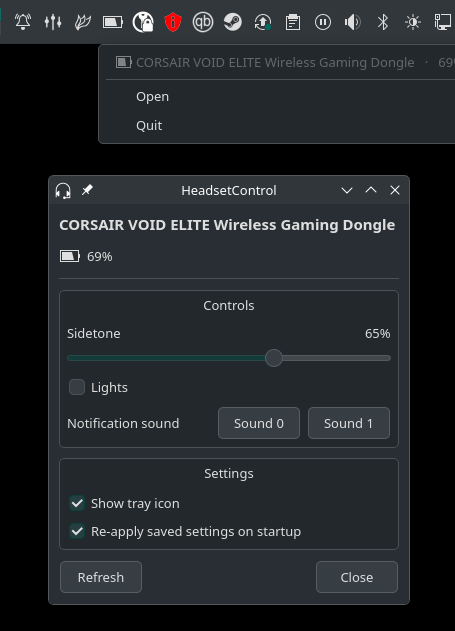
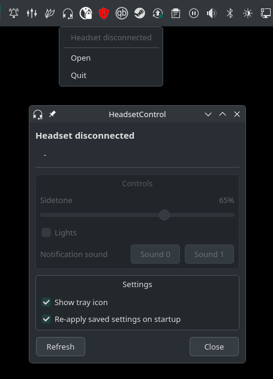

# HeadsetControl GUI

A Qt6 GUI for the [HeadsetControl](https://github.com/Sapd/HeadsetControl) CLI,
with a control window and a system-tray icon.

This is a personal project: I wanted to control my headset from a GUI window and
the system tray instead of the terminal. The scope is intentionally small - it
only implements the features my headset (a Corsair VOID Elite Wireless)
supports: **sidetone**, **lights**, **battery**, and **notification sounds**.
Each control is shown only if the connected device reports that capability, so a
headset missing one of these just won't display it - but the app doesn't cover
HeadsetControl's other features (equalizer, inactive time, chat-mix, etc.). I
only set out to cover what I needed.

Built with Python/PySide6, made for KDE Plasma (Wayland), though the control
window runs on any desktop.

## Screenshots

<table>
  <tr>
    <td align="center"></td>
    <td align="center"></td>
  </tr>
  <tr>
    <td align="center">Connected: controls and battery, with the minimal tray menu</td>
    <td align="center">Disconnected: controls grey out automatically</td>
  </tr>
</table>

## Requirements

- `headsetcontrol` installed and on your `PATH`
  ([install guide](https://github.com/Sapd/HeadsetControl)) - this app is a
  front-end and shells out to it. The udev rules HeadsetControl ships are
  needed for USB access.
- For running from source: Python 3.10+ with PySide6 (`pip install PySide6`).
- The prebuilt **AppImage** bundles Python and Qt, so it only needs
  `headsetcontrol` present.

## Install / Run

**From source:**

```bash
python -m headsetcontrol_gui
# or
./run.sh
```

**AppImage** (no Python/Qt needed, just `headsetcontrol`):

```bash
chmod +x HeadsetControl-GUI-x86_64.AppImage
./HeadsetControl-GUI-x86_64.AppImage
```

Download the latest AppImage from the
[Releases](../../releases) page. (Running an AppImage may require `fuse2`; if it
won't start, run it with `--appimage-extract-and-run`.)

Only one instance runs at a time - launching it again just raises the existing
window instead of starting a second copy (multiple copies would fight over the
USB device and make controls flaky).

## The window and the tray

**Left-click the tray icon** (or right-click -> Open) to open the control
window. The tray menu itself is intentionally minimal - battery, Open, Quit -
because Plasma's tray menu (DBusMenu) can't host widgets like sliders. All the
real controls live in the window:

- **Sidetone** slider, shown as 0-100%
- **Lights** on/off
- **Notification sound** buttons
- **Show tray icon** toggle
- **Re-apply saved settings on startup** toggle

### When does it quit vs. stay running?

The app only lives in the background when the **system tray is active** (the
"Show tray icon" toggle is on *and* your desktop has a tray):

- **Tray active:** closing the window hides it to the tray; the app keeps
  running. `--hidden` starts straight in the tray with no window.
- **Tray not active:** closing the window quits the app, and launching with
  `--hidden` simply exits (there's nothing to show and nowhere to hide).

## Settings persistence & autostart

Your sidetone level, lights state, and the two toggles are saved with
`QSettings` (in `~/.config/headsetcontrol-gui/`) and persist across restarts
and reboots.

Headsets don't keep their sidetone/lights settings when powered off, and the CLI
can't read the current values back - so the app **re-applies your saved sidetone
and lights whenever the headset connects** (at startup and on every reconnect).
So if you autostart it, your configuration is restored to the headset
automatically on boot, and again each time you power the headset on.

**Autostart on KDE Plasma:** add it in
*System Settings -> Autostart -> Add -> Application*, pointing at the AppImage
(or `run.sh`). Pass the `--hidden` flag so it starts quietly in the tray
instead of opening the window on every login.

**Other desktops / generic XDG autostart:** copy the desktop entry (it already
includes `--hidden`):

```bash
cp headsetcontrol-gui.desktop ~/.config/autostart/
```

> Autostart-with-`--hidden` relies on the tray to keep running. If you disable
> the tray (or are on a desktop without one - see below), use a normal launch
> instead.

## Desktop compatibility

- **Control window:** works on any desktop - Wayland or X11, KDE, GNOME, XFCE,
  etc. (the build bundles both the Wayland and X11 Qt platform plugins).
- **Tray icon:** uses StatusNotifierItem.
  - **KDE Plasma:** native. ✅
  - **X11 desktops** (XFCE, MATE, Cinnamon, ...): works via the system tray. ✅
  - **GNOME:** GNOME removed tray support, so you need the
    [AppIndicator extension](https://extensions.gnome.org/extension/615/appindicator-support/).
    Without it there's no tray icon - the app still works as a normal window,
    and the "Show tray icon" toggle is greyed out.

## How it works

The CLI is the backend. State is read with `headsetcontrol -o json` (battery,
capabilities, connection); settings are applied with `-s` (sidetone), `-l`
(lights), and `-n` (notification sound). The UI is built dynamically from the
device's reported capabilities, so headsets without a given feature simply
don't show that control.

## Building the AppImage yourself

```bash
bash packaging/build_appimage.sh
# -> dist/HeadsetControl-GUI-x86_64.AppImage
```

It uses PyInstaller to bundle the app + Python + Qt, lays out an AppDir, and
packs it with `appimagetool`.

## Releases / CI

[`.github/workflows/build.yml`](.github/workflows/build.yml) builds the AppImage
on every push and pull request (uploaded as a run artifact). Pushing a version
tag also publishes a GitHub Release with the AppImage attached:

```bash
git tag v0.1.0
git push origin v0.1.0
```

## Contributing

This is a small personal project, but feel free to fork it and adapt it to your
needs - or open a PR to add better support for other HeadsetControl-supported
headsets and their features. It's released into the public domain (see below),
so do whatever you like with it.

## Layout

- `headsetcontrol_gui/backend.py` - CLI wrapper (read state, set sidetone/lights/notification)
- `headsetcontrol_gui/window.py` - the control window (sliders, toggles, battery icon)
- `headsetcontrol_gui/tray.py` - tray icon + minimal menu, app controller
- `headsetcontrol_gui/__main__.py` - entry point + single-instance guard
- `packaging/` - AppImage build script, launcher, desktop entry, icon
- `.github/workflows/build.yml` - CI: build on push/PR, release on tags

## License

Released into the public domain under the [Unlicense](LICENSE) - no attribution
required, do whatever you want with it.
